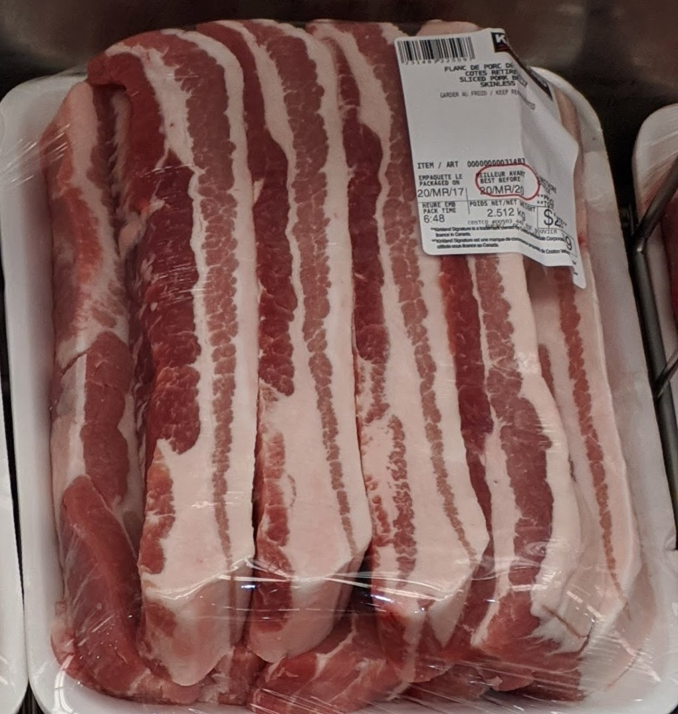
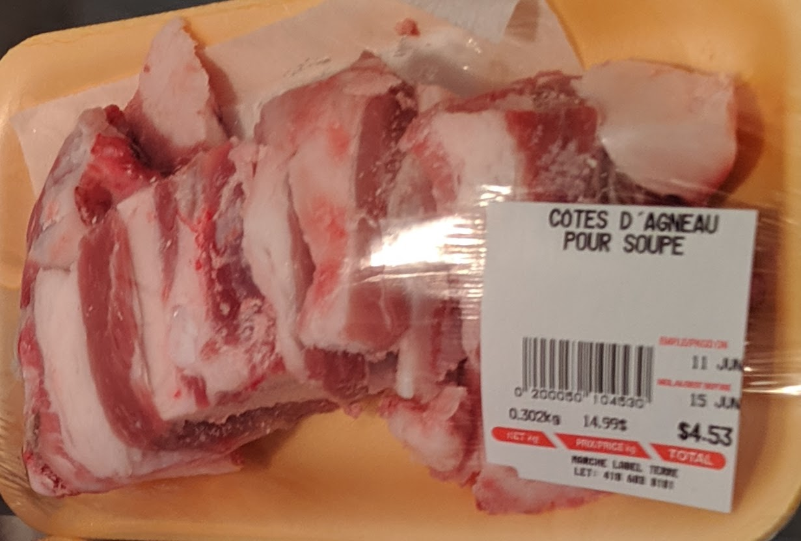

# Being a carnivore in Quebec City

Many butcher shops and grocery stores in Quebec City tend to carry lean meat owing to current public demand---you can blame the dietary guidelines for that. Fattier cuts are harder to come by. However medium (*mi-maigre*, in French) ground beef is a reliable option.

## Meat

### Costco
{.ui .right .floated .tiny .image}
Costco sells AAA ribeye and striploin steaks that are far cheaper than elsewhere. They also have pork belly.

### Boucherie Eumatimi

**Chuck steak** (*palette de boeuf*, in French) at [Boucherie Eumatimi](https://goo.gl/maps/jj4iXi8im8n25Wxv6) is usually well-marbelled at Prime grade while being cheaper, and is delicious when cooked [sous-vide](/sous-vide.html) 24 hours. It needs spices, mainly pepper and garlic.

### Marché Label Terre

{.ui .right .floated .tiny .image}

If beef is not your thing, then [Marché Label Terre](http://www.marchelabelterre.com/) sells **lamb belly** that is supremely fatty. If you ask, they will provide harder to come by organ meats, like spleen and brain.

### Phil smoked meat

For eating out, the only restaurant I can recommend is [Phil smoked meat](http://philsmokedmeat.com/). Delicious smoked meat, but be wary of what else they add to it. Last I checked, it was a variety of spices with small amounts of sugar. The waitresses are not always well informed, so ask the owner directly as to what else goes in the meat.

## Animal fat

### Fatworks

[Fatworks](https://fatworksfoods.com/) is a food company in the United States of America, so you will need to order online and pay customs fees. They sell **organic 100% grass-fed tallow** which I find to be a perfect fat to cook meat with (it imparts flavour when stir-frying ground beef).

## Dairy products
{.ui .right .floated .tiny .image}
Dairy products sold often include plant-based fillers. In Quebec, so far from what I found, I'd recommend:

* IGA sells [organic cream cheese by Arla](https://www.arlafoods.ca/our-brands/arla-cream-cheese/) that is devoid of plant-based products.
* IGA sells [40% heavy cream by Chagnon](http://laiteriechagnon.com/en/creme-40.php) that is made of just milk, without any conservation agents.

