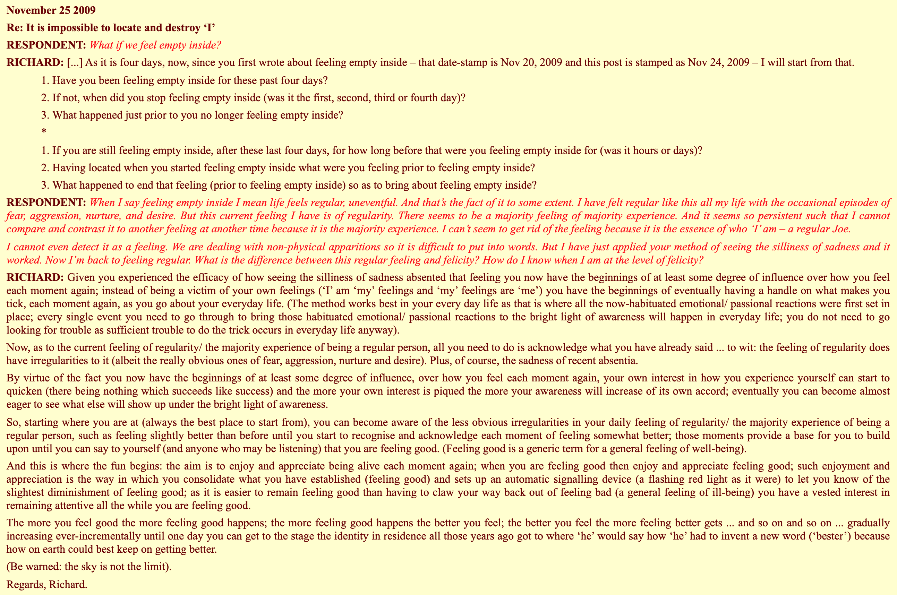

# Actualism HOWTO

The following is my delineation of the [[7c5337fc]] – [the ongoing enjoyment and appreciation of this moment of being alive](http://www.actualfreedom.com.au/richard/abditorium/method.htm#The%20Actualism%20Method) – *as I understand it*:

- Set consistent [[[426d55fc]]] as the goal to obsessively and fascinatedly (see [[[0f896f5f]]]) achieve, with the help of effortless (see [[[7857b534]]]) [[[6e564791]]] that is unlocked by [[[8184b1bc]]].
- Experientially realize that it is my **choice** as to how I feel right now: <974ce006>
- Stay **affectively aware** (24/7[^aff]) of how I am experiencing this moment (the only moment) of being alive
- Once I find myself no longer feeling good (thanks to the aforementioned **affective awareness**), stop whatever is it I'm doing, and engage cognitive attention[^aff] to **trace back to the exact trigger** that *caused* that feeling. 
  1. Recall, in memory, the moment prior to the trigger wherein you were feeling good
  1. Then, from that point in memory, trace forward so as to [[[aab870e2]]]
- Seeing the **silliness** of having such an incident puts me back on track (i.e., I resume feeling good).
  - Remember: This happens instantly with [[[7857b534]]] only if [[[8184b1bc]]] is in place. If the method does not work for you, check your [[[8184b1bc]]]!
- Make a mental note of the trigger such that in future if a similar kind of incident is to occur, I can decline going down this path by **nipping it in the bud**
- The goal, ultimately, is to as-constantly-as-possible continue to enjoy and appreciate this moment of being alive (with the constant **affective awareness** of the same; else, it is impossible to attend to any dips in feeling good). Then, up-level that level of enjoyment, via identifying subtler dips in feeling good.

[^aff]: Note that this does *not* mean that you must renunciate your everyday activities, which you can do at the same time as practicing actualism. See [[[42586bf9]]].

Here's how the method is officially described:

> RICHARD: Once the specific moment of ceasing to feel good is pin-pointed, and the silliness  of having such an incident as that (no matter what it is) take away one’s enjoyment and appreciation of this only moment of being alive is seen for what it is – usually some habitual reactive response – one is once more feeling good ... but with a pin-pointed cue to watch out for next time so as to not have that trigger off yet another bout of the same-old same-old. This is called nipping it in the bud before it gets out of hand ... with application and diligence and patience and perseverance one soon gets the knack of this and more and more time is spent enjoying and appreciating this moment of being alive. And, of course, once one does get the knack of this, one up-levels ‘feeling good’, as a bottom line each moment again, to ‘feeling happy and harmless’ ... and after that to ‘feeling perfect’. --[This Moment Of Being Alive](http://www.actualfreedom.com.au/richard/articles/thismomentofbeingalive.htm)

And here's how it is described in a more verbose manner to someone who appears somewhat depressed and is struggling to practice it:

<http://www.actualfreedom.com.au/richard/listdcorrespondence/listd11.htm>

