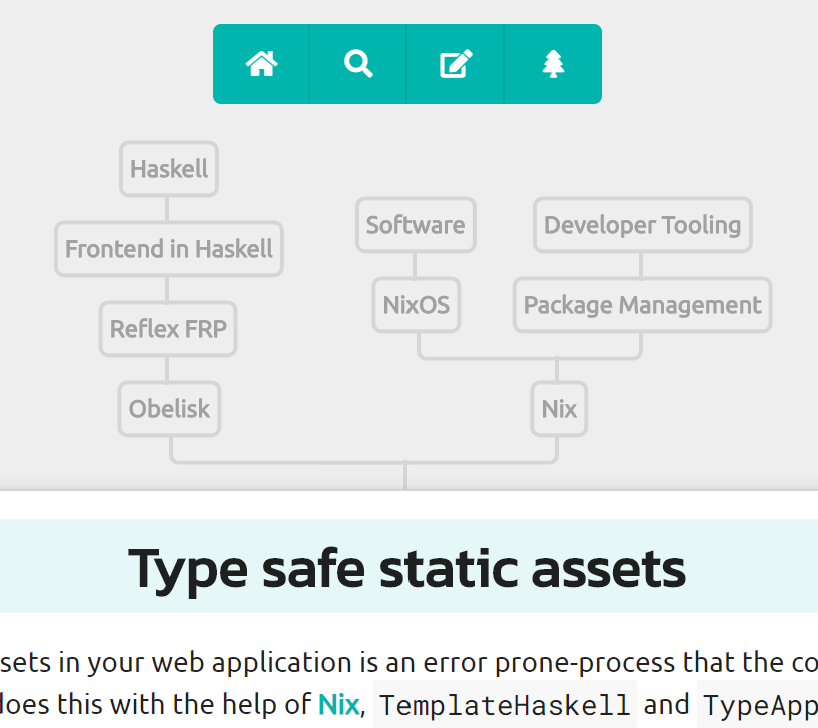
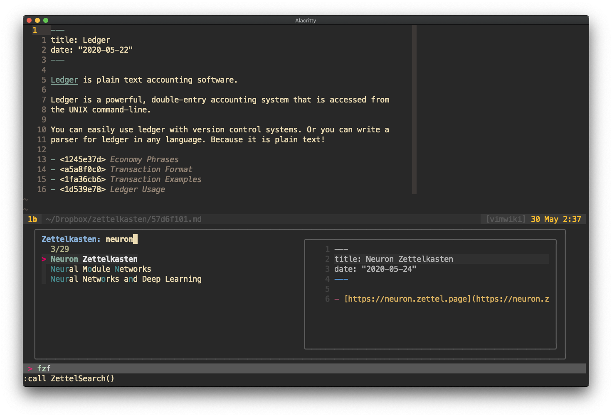

# Neuron 0.6 and Pandoc

{.ui .warning .message}
Work in progress. Please do not share.

<b6df4059?cf> ([GitHub repo](https://github.com/srid/neuron)) is a future-proof note-taking tool I have been working on. I just released version [0.6](https://github.com/srid/neuron/releases/tag/0.6.0.0), whose major highlight is that neuron is now based on the **Pandoc** AST, which means that it can support any format supported by Pandoc. Experimental **org-mode** support is in to begin with.

## Better Markdown

Previous versions of neuron used [mmark](https://hackage.haskell.org/package/mmark) parser which advertises itself as "strict". This caused problems with certain links that caused the parser to fail. In version 0.6, I switched over to use [commonmark-hs](https://github.com/jgm/commonmark-hs), which is the Haskell implementation of the [**CommonMark** specification](https://commonmark.org/), written by the same author of Pandoc. The commonmark-hs parser includes [a bunch of nifty **extensions**](https://github.com/jgm/commonmark-hs/tree/master/commonmark-extensions) that are all made available in neuron. In addition, you can style your Markdown notes using supported Semantic UI classes ([see here](https://github.com/srid/neuron/issues/176)), as well as use raw HTML if necessary.

## Uplink Tree

I find arbitrary graph views to be rarely useful. Neuron on the other hand has what is known as a "uplink tree", which represents the *subset* of the backlink graph fo a zettel/ note. In Zettelkasten-speak, we talk of a note "branching" to another. The uplink tree displays all notes "branching" to the note being viewed. 

Uplink Trees are similar to nagivation panel or category tree, except that the heterarchy is built organically over time based on how the notes are linked. In the screenshot below, you are viewing the up link tree of the note titled "<2017101?cf>".

{.ui .centered .large .image}

## Docker images

While Nix is still the recommended way to install, we now have auto-created Docker images for neuron. With one `docker run ...` command you can run neuron in a matter of seconds. The whole image is only about 100MB in size. See [Docker workflow](https://neuron.zettel.page/c6176636.html) for details.

## Vim

In addition to Emacs, there is now an Vim extension for neuron. See [neuron.vim](https://github.com/ihsanturk/neuron.vim). It supports "virtual titles" in neovim, where the title of a linked note is displayed next to the link, as you can see from the screenshot below.

## Automatic Publishing

You can now setup your neuron notes to publish *automatically* on the web. See [neuron-template](https://github.com/srid/neuron-template#readme) to get started. The gist of the idea is that we use GitHub Actions and Pages to update your published site as you change your notes in the Git repository. I publish every neuron site in ths way.

You can of couse alternative choose to self-host it, say as a systemd service (there is [documentation on this](https://neuron.zettel.page/6479cd5e.html)).

## Error reporting

Neuron 0.6 includes resilient error handling. If there is any error in your notes, the command line tool will report them both in the console and the web interface, without breaking its workflow.

{.ui .centered .huge .image}